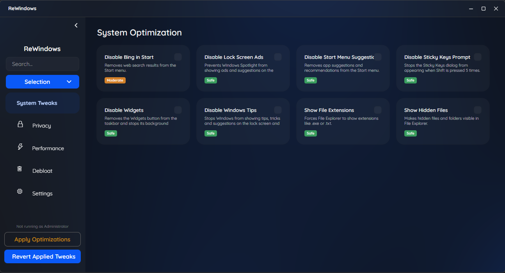
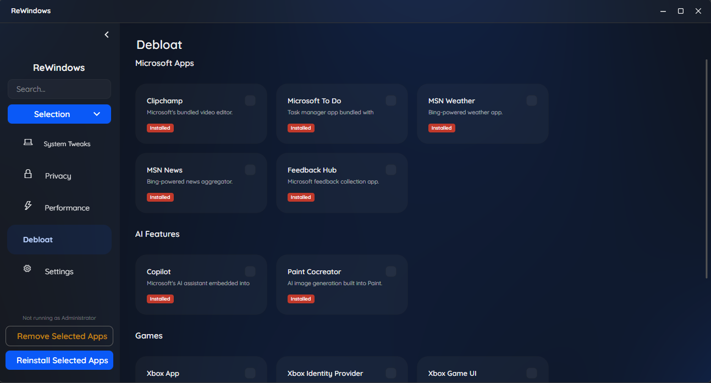

# ReWindows

A lightweight Windows optimization tool built with [Avalonia](https://avaloniaui.net/) and [SukiUI](https://github.com/kikipoulet/SukiUI). Apply, track, and revert common Windows privacy, performance, and system tweaks through a clean modern interface - no bloat, no telemetry, no nonsense.


---

## Screenshots

| Tweaks | Debloat |
|--------|---------|
|  |  |

---

## Features

- **Privacy** - disable telemetry, advertising ID, Cortana, activity history, location tracking, and more
- **Performance** - disable transparency effects, animations, Game Bar, hibernation, and others
- **System** - show file extensions and hidden files, disable Bing in Start, widgets, sticky keys, and more
- **Debloat** - remove preinstalled Microsoft apps, AI Slop, Xbox components, and third party installs
- **Smart apply** - detects already applied tweaks and asks what you want to do about it
- **Full revert** - every tweak can be undone, individually or all at once
- **Saves your settings** - theme, background style, and applied state all persist between sessions
- **Admin elevation** - prompts to restart with administrator rights when a tweak needs it

---

## Requirements

- Windows 10 or Windows 11
- Administrator privileges (needed for some tweaks and debloat)
- [winget](https://learn.microsoft.com/en-us/windows/package-manager/winget/) (only needed if you want to reinstall debloated apps)

---

## Installation

Go to the [Releases](../../releases) page and download the latest `ReWindows.exe`. No installer, just run it.

> Some tweaks write to `HKEY_LOCAL_MACHINE` which requires administrator rights. ReWindows will prompt you to relaunch with elevated permissions if it needs to.

---

## Building from source

**You will need:**
- [.NET 10 SDK](https://dotnet.microsoft.com/download)
- Visual Studio 2022 or Rider

```bash
git clone https://github.com/Synalix/ReWindows.git
cd ReWindows
dotnet build
```

To build a single self-contained executable:

```bash
dotnet publish -c Release -r win-x64 --self-contained true -p:PublishSingleFile=true
```

Output lands in `bin/Release/net10.0-windows/win-x64/publish/`.

---

## How it works

ReWindows reads and writes Windows registry keys to apply or revert tweaks. On startup it checks each tweak against your current registry state and marks it accordingly. Nothing gets changed until you hit Apply.

Settings and theme preferences are saved to `%AppData%\ReWindows\settings.json`.

---

## Tweaks overview

| Category | Count |
|----------|-------|
| Privacy | 10 |
| System | 8 |
| Performance | 6 |
| Debloat | 11 |

Safety ratings:

- 🟢 **Safe** - fully reversible, no risk
- 🟡 **Moderate** - reversible but may affect some functionality
- 🔴 **Dangerous** - use with caution

---

## Good to know

- Creating a system restore point before applying tweaks is always a good idea
- Some tweaks need a restart or sign-out to fully take effect
- Debloat uses PowerShell's `Remove-AppxPackage` under the hood. Reinstalling uses winget
- ReWindows only touches registry keys and AppX packages, no system files

---

## Roadmap

- [ ] Progress indicator during apply and debloat
- [ ] Per-tweak revert instead of all-at-once
- [ ] Export and import tweak profiles
- [ ] More debloat options
- [ ] Startup optimization scheduler

---

## Built with

- [Avalonia](https://avaloniaui.net/)
- [SukiUI](https://github.com/kikipoulet/SukiUI)
- [CommunityToolkit.Mvvm](https://github.com/CommunityToolkit/dotnet)

---

## License

MIT - see [LICENSE](LICENSE) for details.
